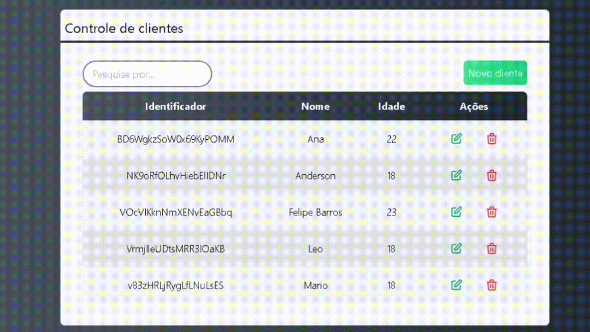

# Simple CRUD

This is a simple customer tracking system. It is possible to create, edit, delete and search for a customer in the database.



---

To have a clone of this application on your machine just follow the steps below:

1 - Clone the repository in the way that suits you best.

2 - Access the folder and install the dependencies.

```bash
cd .\React-next-crud
npm install
```

3 - Configure a database in firebase console and connect the application via .env.local file

4 - Run the application.

```bash
npm run dev
```

5 - Enjoy!
